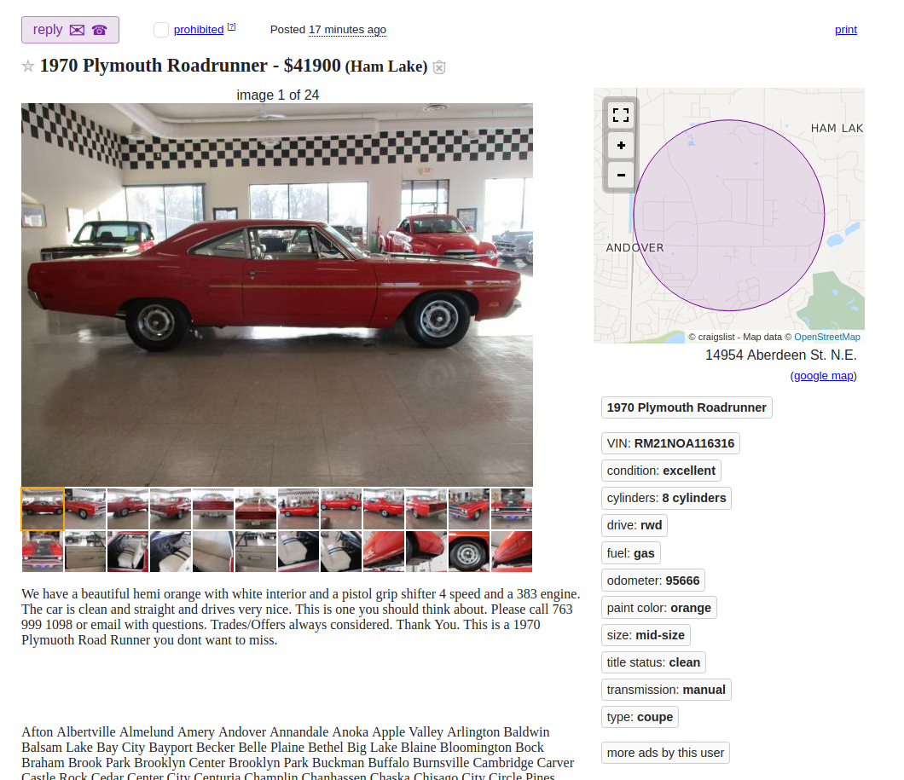
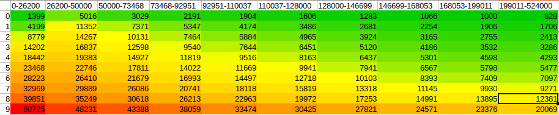
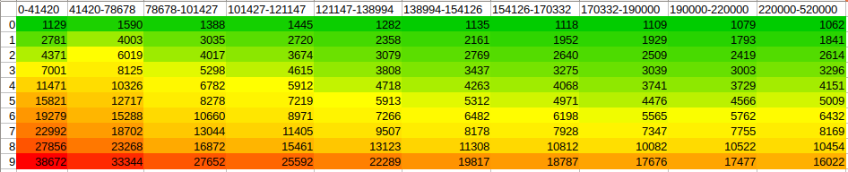

# Used Cars for Sale in the United States

## Our Motivation
---

Buying a car is never an easy task, especially when buying a used one. So many different factors go into determining the price of a vehicle that it's difficult to accurately predict what one should be paying. Aside from this there are some parts of the country where used car sales are few and far between and the prices are not so desirable. Using our dataset of used car sales we aimed to clarify some of these unknown variables and provide an easier experience for those searching for a car. Our goal was not to simply create static visualizations that compared cars from winter 2018, but instead we aim to create an application of sorts that allows users to continuously update the vehicles in their search.

## The Dataset
---

Our dataset contains 1.7 million used vehicle sales from Craigslist.org

The columns are as follows:

* **url** - Unique - *Listing URL*
* **city** - String - *Given Craigslist region*
* **price** - Integer - *Listing price*
* **year** - Integer - *Year of manufacturing*
* **manufacturer** - String - *Manufacturing company*
* **make** - String - *Model of vehicle*
* **condition** - String - *Condition of vehicle*
* **cylinders** - String - *Number of cylinders*
* **fuel** - String - *Type of fuel required*
* **odometer** - Integer - *Miles traveled*
* **title_status** - String - *Vehicle title status/existance*
* **transmission** - String - *Transmission of vehicle*
* **drive** - String - *Drive of vehicle*
* **size** - String - *Size of vehicle*
* **type** - String - *Type of vehicle*
* **paint_color** - String - *Color of vehicle*
* **image_url** - String - *Image URL*
* **latitude** - Integer - *Latitude of listing*
* **longitude** - Integer - *Longitude of listing*
* **county_name** - String - *Name of County in which listing is located*
* **county_fips** - Integer - *County of listing's Federal Information Processing Standards code*
* **state_code** - String - *Name of state in which listing is located*
* **state_name** - String - *2 letter state abbreviation*
* **state_fips** - Integer - *State of listing's Federal Information Processing Standards code*
* **weather** - Integer - *Average historical temperature of listing's location between October and November*

### Initial Creation
---

We deployed a scraper which utilized python and requestsHTML to take every used car for sale from every North American Craigslist website. Regions were located by continuously following *Nearby CL* links until no unexplored websited remained.

Following the cars+trucks link takes us to the following page.

The price and image url were pulled from the search page, while the rest of the variables were pulled from the main listing page.

Latitude/Longitude was pulled from a specific tag on the Google Maps object, and the rest were pulled from the variables below. Not all variables were listed with every vehicle, so some rows contain blank values. 

The program loops through every listing on the search page then continues looping through the search pages (e.g. the next button at the bottom of search results) until there are no more results. Once the end is reached the program moves on to the next untapped region and restarts this process, continuing until all regions have been explored.

### Secondary Data Gathering
---
The data we have gathered so far seems very promising for exploration, however, we feel like it should be more grounded, literally. We wanted to connect each car being sold on Craiglist to a State and even a County. This would help us in our visualization and might give us some insights in our analysis.

Before we look into how to bring the geographical data, we need to decide whether we think we should only use our initial 700,000 entries taken by the end of October, or to incorporate more recent entries from Craiglist that we were able to scrape at the beginning of November. After some thinking, we've decided that it would not hurt to merge the data we've gathered between October and November. We started with 700,000 entries of vehicles being sold by late October and expanded to 1,700,000 by early November. However, this is not going to be an easy task.

#### Merging Data
We need to find out a way to merge the data, and to remove any duplicates that might had been on the website when we started our initial data collection and was still live on Craiglist by the time we did our second scraping. Furthermore, we did not want to keep working on the data in its CSV format, but rather use SQL for and have a Database on disk until we're done with our data collection. We decided that the data can be saved as a db format using sqlite, and that we would make URL column a primary key since it is a unique field. Having the URL as a primary key helped us merge the data we scrapped in October and November without any duplicates. Alas, we have 1.7 million vehicles in our dataset.

#### Finding Geographical Information
As we beging, we assumed that our data having longitudes and latitudes would make this quest an easy one, but such is life. First, we have to understand that our data at this point is very big, and that a simple API would not let us make 1.7 million calls, and then we have to also know that sqlite does not support concurrent tasks and would only allow one entry to be updated per database. 

We tried searching for any database that would provide us the State and the Country given that we pass in longitude and latitude, but all our efforts were not successful. At one point, we almost gave up on this task, especially that the kind of providers we could find were either unreliable or quite expensive.

Fortunately, we came across a Federal website that among the data they'd provide you given a longitude and a latitude were what we have been looking for. The [Federal Communications Commission Area API](https://geo.fcc.gov/api/census/#!/area/get_area) allowed us to send in a longitude and latitude, and to get the following data:
* county_name
* county_fips
* state_code
* state_name
* state_fips

If you think about it, this is an awesome tool provided by the American Government, and the fact that we were able to not only collect the relative data of 1,700,000 entries but also to do that in under 2 hours is even more impresive. Long story short, we implemented a multi-threaded program that made about 15,000 requests per minute. We also had to migrate from Sqlite to PostgreSQL, since the former did not have any multi-threading support.

All in all, we were able to to get the geographical data we wanted for 1,700,000 entries, and not only to that for this huge amount of data, but to also do it within two hours, which seemed impossible when we started. We had some failed responses but that is because the sent longitudes and latitudes belonged to Canada, and this failed responses helped us get rid of any entries outside of the United States.

#### Weather Data
Also, we were interested in seeing whether weather might have an influence on the data. Also, after taking Prof. Lee, he alerted us that some people might be selling their cars because of floods, and we wanted to keep such idea in our minds for possible further exploration.

Unfortunately, to collect specific data, such as floods at specific counties during specific dates, that would've required us to spend thousands of dollars on services that provide such information. Our only hope was to find a governmental data to help us with our data collection. We found [US Climate Data](https://www.usclimatedata.com/climate/alabama/united-states/3170) website that had historical weather data for each State. We decides that this might be a long shot but we got the average historical temperature for October and November for each state and incorporated that in our dataset.

## Basic Exploration
---

## Big Questions
---

## Further Exploration
---

### Heatmaps
---

#### Map by Number of Listings

[Interactive Version Here](https://plot.ly/~reesau01/2)

This map displays the number of vehicles listed per county. Unsurprisingly, counties with high amounts of listings lie along the west/east coast, along with Flordia and metropolitan areas throughout the country (Denver, Chicago, Dallas, Minneapolis, etc.). The map also indicates that, with the exception of Denver and the west coast, the west side of the country is quite sparse when it comes to car listings. The east side of the United States contains far more sales.

#### Map by Average Price

[Interactive Version Here](https://plot.ly/~reesau01/4)

This map graphs the average price of vehicles by county across the United States. One striking observation is the increase in vehicle cost in rural areas. The prices of cars in states such as Idaho, North/South Dakota, and Wyoming, and rural parts of the midwest are far more expensive than those in the Eastern half of the nation. Cars on the East Coast also cost a faire amount less than those on the West Coast, with the coast of California boasting some pretty high prices.

### Quantile Tables
---

Lets say we're searching for a used car, but we have no idea what a fair price would be. Enter quantile tables. These tables aren't super eye-catching, but they're very practical tools for determining what we should be paying for a given car. They take two numeric values, and in this example I'll use odometer (miles the car has been driven) and price given that it's a very practical combination when searching for a decent used car. The x axis (columns) will be grouped by a range of odometers determined by percentiles. 0-10th percentile may be 0-25000 miles driven, 11-20 could be 25000-50000, etc. Once these groups are determined we slice the our dataframe into 10 seperate frames according to which category they fall under (a car with 12500 miles will be in the first group while 45000 will be in the second). Finally, we find percentiles for the prices of cars within each group. This sounds somewhat complicated but the graphs are far easier to understand and resemble simple heatmaps.

Above is a graph featuring the entire dataframe, sorted by odometer with means of price. For example, lets say we wanted to purchase a car with no more than 70000 miles on it. We can check out the fourth column (46000-69295) to get an estimate on what a good price would be. The first row tells us that the top 10% of deals have an average price of \$3207, which seems very affordable yet somewhat unrealistic. It would be wise to target a top 30% deal, which would mean that our car would cost less than $10048.

The first graph is great but it's very broad and if we're looking to buy a specific car it's not going to help us very much. Above is a graph plotting the same odometer/price, only this time the data is taken from Fords only. We can see that Ford's are a little more expensive and have a tad more miles on them, but it's still not descriptive enough for us data scientists.

As broke college students we are not looking for the greatest quality car, so this graph shows Fords with the 'Good' condition tag. Now we can see that a top 30% deal our ~70000 mile car shouldn't cost any more than $6000, probably a little less. But still, a Ford in good condition isn't as descriptive as we'd like as it still applies to a plethora of vehicles

Finally, a chart specific enough to draw accurate conclusions from. This chart shows 'Good' mid-size sedans manufacturered by Ford. We now see that the car that we once thought we should try to buy for less than \$10000 should be pursued for no more than $3000. Overall these quantile tables are an excellent way to determine an asking price for a used car, they're easily automatable (as displayed in the Flask app) and also easy to build by hand.

## Flask App
---

## World Happiness Index
---

## What's Next?
---
